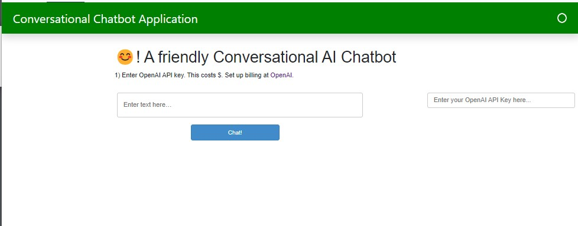

Check out the configuration reference at https://huggingface.co/docs/hub/spaces-config-reference

## Openai  Powered Chatbot with LangChain and Panel.

 
  <kbd>
    
  </kbd>

### App URL

[chatbot](https://huggingface.co/spaces/chukypedro/chatbot)

